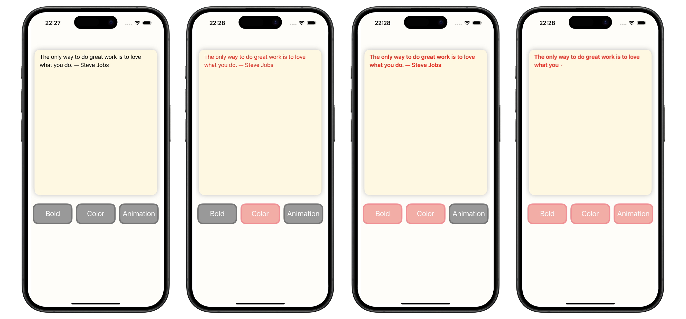

# AttributedStringTest(iOS)


A tiny **UIKit** project that styles a quote with **NSAttributedString**.  
The bottom bar is a **UICollectionView** using **UICollectionViewDiffableDataSource** to toggle **Bold**, **Color**, and a **Typewriter** animation. The **UICollectionViewDiffableDataSource** was used intentionally to practice styling/selection state and make it easy to add more actions later.


---

## 🛠️ Tech Stack
- **Swift 6.1+**, **Xcode 16+**, **iOS 18.0+** target
- **UIKit** for UI
- **MVC** architecture
- **UICollectionViewDiffableDataSource** for implementing a UICollectionView for button's section (plannd to add more buttons later)
- **UICollectionViewCompositionalLayout** + **NSMutableAttributedString**

---

## 📸 Screenshots
| 

---
## 🎥 Demo
▶️ [Watch the demo](docs/demo.mp4)


---

### Setup
1. **Clone** the repository:
   ```bash
   git clone https://github.com/sh-raz/AttributedString.git
   cd AttributedStringTest
   ls
   ```
2. **Open** `AttributedStringTest.xcodeproj`
3. **Run** on a simulator or device

---

## 🤝 Contributing
1. Fork the repo
2. Create a feature branch: `git switch -c featureName`
3. Commit: `git commit -m "commit message"`
4. Push: `git push -u origin featureName`
5. Open a Pull Request


